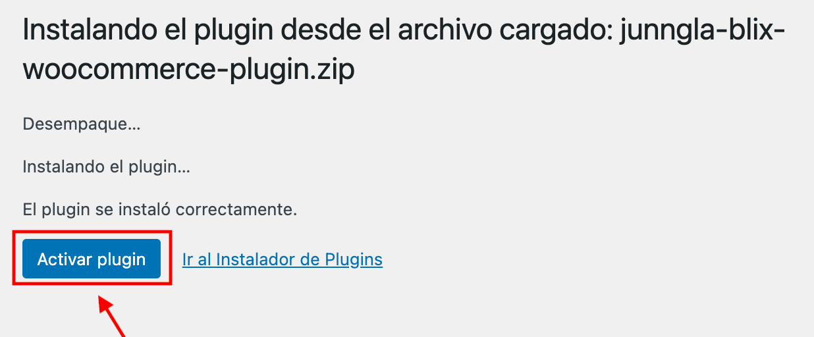

<h1 align="center">
   
  
   
  Plugin Woocomerce
   
</h1>

<h4 align="center">Instructivo de Configuracion he instalacion</h4>

  <a href="#Descarga">Descarga</a> •
  <a href="#Descarga">Instalacion</a> •
  <a href="#Configuración">Configuracion</a> •

## Descarga

* Para poder obtener la ultima version estable, descarga el archivo "junngla-blix-woocomerce-plugin.zip", que se encuentra en la seccion de release del repositorio.

## Instalacion

* importante!, este plugin trabaja en conjunto con woocommerce, por lo tanto es necesario tener instalado woocommerce antes de poder iniciar la esta configuracion.

1. Ingresar al dashboard de wordpress ir a la seccion de "Plugin" y "Agregar un nuevo" y seleccionar "junngla-blix-woocomerce-plugin.zip".

2. Active el plugin, al momento de instalar o a través del menú 'Plugin instalados' en WordPress.

3. Una vez instalado, desde el menu principal selecciona "Ajustes" que encontraras dentro del menu de "Woocommerce", en la pestaña de "Pagos", debes de gestionar y habilitar el medio de pago Blix.

## Configuración

Configurar Gateway:

* Añadir Titulo que se mostrara al cliente al momento de presentar el medio de pago en el formulario de compra.

* Añadir URL Blix a la cual se redireccionara al cliente cuando decida pagar.

* Añadir Llave de medio de pago correspondiente a tu comercio, con el cual Blix te identificara.

* Añadir Secret de pago.

## License

GPL2
